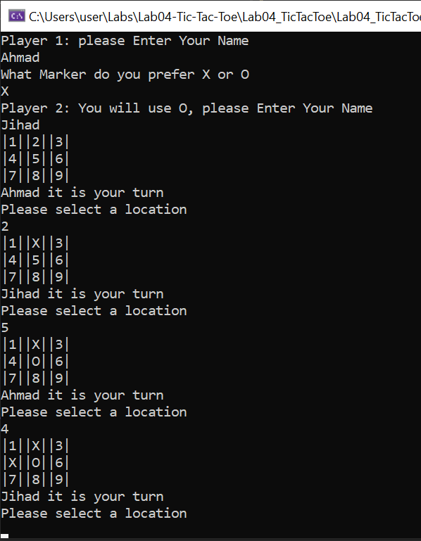
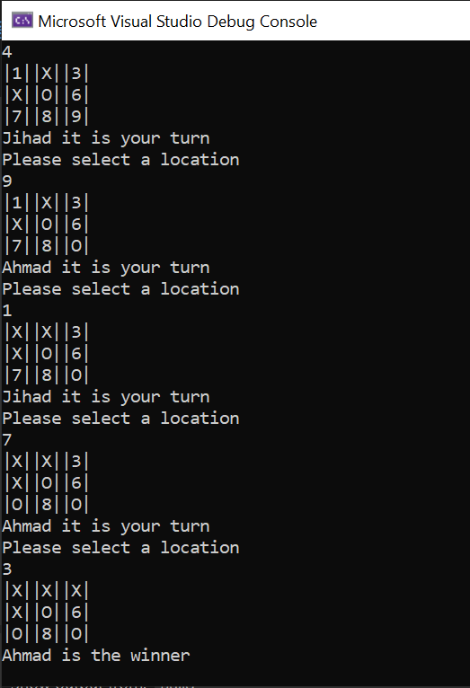

# Lab04-Tic-Tac-Toe
This console application aim to represent tic tac toe game in a simple way.
- It is for two players. in the beginning every player enter his\her Name and the first player decide if he\she want 'X' or 'O', the second player will take the other marker.

- If it's your turn, you can play by enter a number to change it to either 'X' or 'O' according to your marker.

- You will keep entring until someone win or a Draw happend

Here is an example:

- A winner detected if 'X' or 'O' existed on 3 positions in a line Horizontally or vertically or diagonally.

Here Ahmad is the winner:

- If a draw happened the console will tell you it's a Draw.